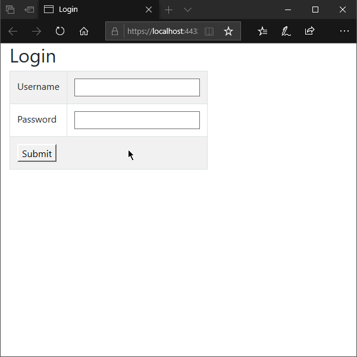

# **JWT** защищенный доступ к API-интерфейсам с jQuery Ajax  

#### **JWT (JSON Web Token)** – представляет стандартизированный формат упаковки данных для безопасного способа передачи информации между двумя сторонами.  

________________________________________________________________

#### Задача обеспечить безопасный способ взаимодействия с API-интерфейсами приложения и, в частности, защитить методы действия в классе контроллера Reservation:  

 - Разработать действующий пример веб-приложения

 - Выделить полноценный доступ исключительно учётной записи администратора
(все отличные учётные записи могут иметь только ограниченный доступ)

 - Сгенерировать JWT маркер доступа

 - Написать Ajax-запросы, при помощи которых выполнить вызов защищённого метода и извлечь импровизированные данные
 
________________________________________________________________

#### Решение создано на платформе *```ASP.NET Core```* с применением паттерна *```MVC```*.

**Ассистирующая группа технологий:**  
> ```C#```, ```ASP.NET Razor```, ```LINQ```, ```Authentication.JwtBearer```,  
> ```JavaScript```, ```jQuery```, ```Ajax```


**Демонстрация:**



--
*Веб-приложение "JWT", подготовил Александр Усов*
